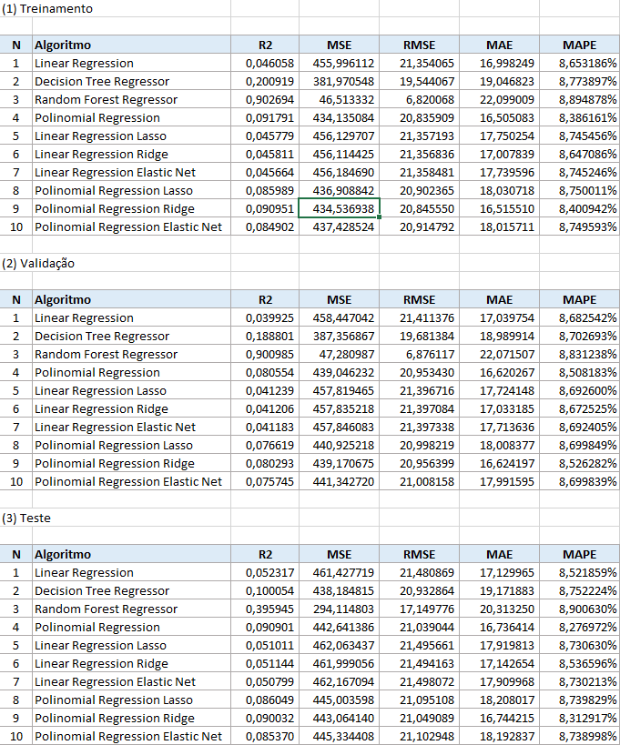

# ENSAIO DE MACHINE LEARNING

## Descrição
A empresa Data Money acredita que a expertise no treinamento e ajuste fino dos algoritmos feito pelos Cientistas de Dados da empresa é o principal motivo para os ótimos resultados que as consultorias vem entregando aos seus clientes.

## Objetivo
O objetivo desse projeto é realizar ensaios com algoritmos de Classificação, Regressão e Clusterização, para estudar o impacto em seu desempenho, à medida em que são alterados os valores dos principais parâmetros de controle de overfitting e underfitting.

# PLANEJAMENTO DA SOLUÇÃO

## Produto final
O produto final é um conjunto de 7 tabelas mostrando o desempenho dos algoritmos, avaliados usando múltiplas métricas, para 3 conjuntos de dados diferentes: treinamento, validação e teste.

## Algoritmos ensaiados

### Classificação:
- <b>Algoritmos</b>: KNN, Decision Tree, Random Forest e Logistic Regression.
- <b>Métricas de desempenho</b>: Accuracy, Precision, Recall e F1-Score.

### Regressão:
- <b>Algoritmos</b>: Linear Regression, Decision Tree Regressor, Random Forest Regressor, Polinomial Regression, Linear Regression Lasso, Linear Regression Ridge, Linear Regression Elastic Net, Polinomial Regression Lasso, Polinomial Regression Ridge e Polinomial Regression Elastic Net.
- <b>Métricas de desempenho</b>: R2, MSE, RMSE, MAE e MAPE

### Agrupamento:
- <b>Algoritmos</b>: K-Means e Affinity Propagation.
- <b>Métricas de desempenho</b>: Silhouette Score

## Ferramentas utilizadas
Python 3.10 e Scikit-learn

# DESENVOLVIMENTO

## Estratégia da solução
Para o objetivo de ensaiar os algoritmos de Machine Learning, eu vou escrever os códigos utilizando a linguagem Python, para treinar cada um dos algoritmos e vou variar seus principais parâmetros de ajuste de overfitting e observar a métrica final.
O conjunto de valores que fizerem os algoritmos alcançarem o melhor desempenho serão aqueles escolhidos para o treinamento final do algoritmo.

## O passo a passo
- Passo 1: Divisão dos dados em treino, teste e validação.
- Passo 2: Treinamento dos algoritmos com os dados de treinamento, utilizando os parâmetros “default”.
- Passo 3: Medir o desempenho dos algoritmos treinados com o parâmetro default, utilizando o conjunto de dados de treinamento.
- Passo 4: Medir o desempenho dos algoritmos treinados com o parâmetro “default”, utilizando o conjunto de dados de validação.
- Passo 5: Alternar os valores dos principais parâmetros que controlam o overfitting do algoritmo até encontrar o conjunto de parâmetros apresente o melhor desempenho dos algoritmos.
- Passo 6: Unir os dados de treinamento e validação
- Passo 7: Retreinar o algoritmo com a união dos dados de treinamento e validação, utilizando os melhores valores para os parâmetros de controle do algoritmo.
- Passo 8: Medir o desempenho dos algoritmos treinados com os melhores parâmetro, utilizando o conjunto de dados de teste.
- Passo 9: Avaliar os ensaios e anotar os 3 principais Insights que se destacaram.

# OS TOP 3 INSIGHTS

### Insight Top 1
Os algoritmos baseados em árvores - tanto <i>Decision Tree</i> quanto <i>Random Forest</i> - foram os que apresentaram os melhores desempenhos sob condições de produção, isto é, no conjunto de dados de teste. Isso foi observado tanto nos ensaios de classificação quanto no ensaios de regressão. Em especial, os testes mostraram ótimo desempenho da <i>Random Forest</i> no ensaio de regressão, tomando-se por base a métrica MSE.

## Insight Top 2
O desempenho dos algoritmos de classificação sobre os dados de teste/produção ficou bem próximo do obtido sobre os dados de validação.

## Insight Top 3
Todos os algoritmos de regressão apresentaram erro percentual elevado, haja vista a métrica MAPE superior a 8,2%. Tem-se aí a possibilidade de pesquisarmos a melhor seleção de atributos e preparação do conjunto de dados, como forma de melhorar o desempenho final dos algoritmos.

# RESULTADOS

## Ensaio de classificação:

## Ensaio de regressão:

## Ensaio de clusterização:

# CONCLUSÃO
No presente ensaio de Machine Learning, consegui adquirir experiência e entender melhor sobre os limites dos algoritmos entre os estados de underffiting e overfitting.

Algoritmos baseados em árvores são sensível quanto a profundidade do crescimento e do número de árvores na floresta, fazendo com que a escolha correta dos valores desses parâmetros impeça os algoritmos de entrar no estado de overfitting. Os algoritmos de regressão, por outro lado, são sensíveis ao grau do polinômio. Esse parâmetro controla o limite entre o estado de underfitting e overfitting desses algoritmos.

Esse ensaio de Machine Learning foi muito importante para aprofundar o entendimento sobre o funcionamento de diversos algoritmos de classificação, regressão e clusterização e quais os principais parâmetros de controle entre os estados de underfitting e overfitting.

# PRÓXIMOS PASSOS
Como próximos passos desse ensaio, pretendo ensaiar novos algoritmos de Machine Learning e usar diferentes conjuntos de dados para aumentar o conhecimento sobre os algoritmos e quais cenários são mais favoráveis para o aumento do seu desempenho.
